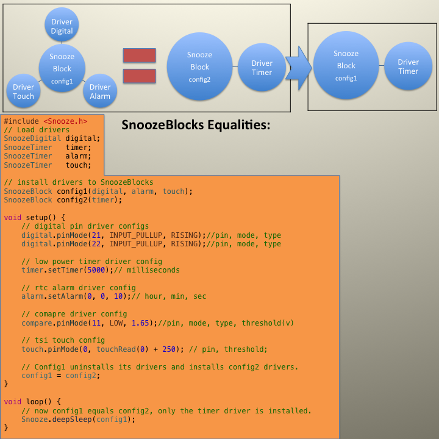
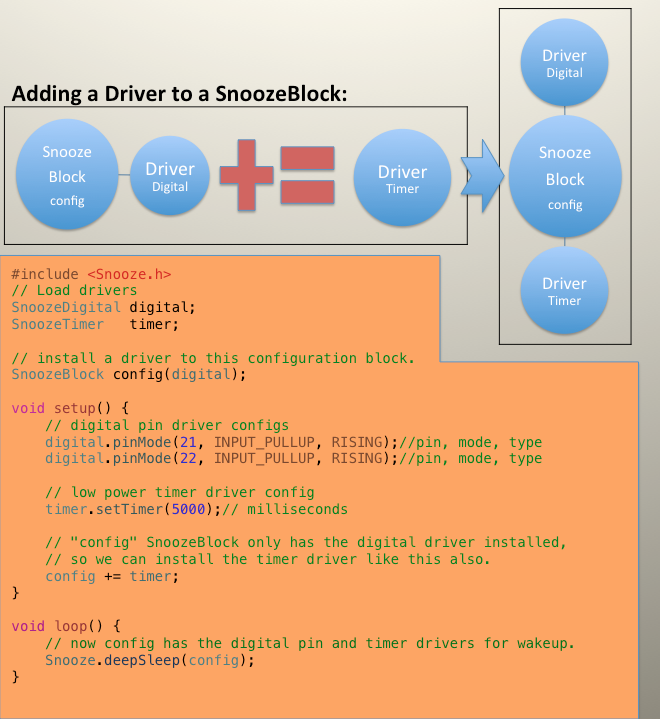
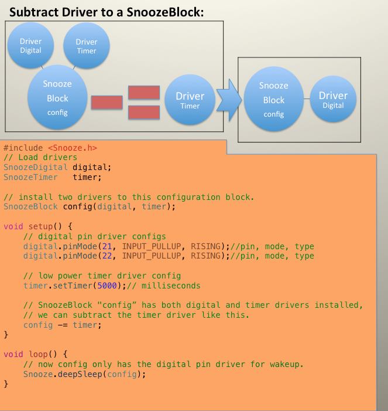
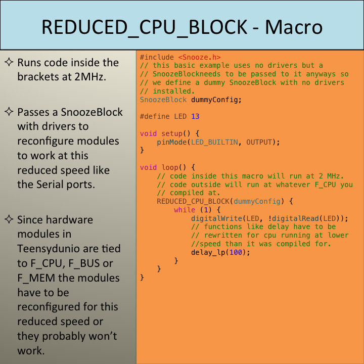

# Snooze v6.3.4

---
Low power library for the Teensy LC/3.2/3.5/3.6 class microcontrollers.
---
Example usage:
```
#include <Snooze.h>
// Load drivers
SnoozeDigital digital;

// install drivers to a SnoozeBlock
SnoozeBlock config(digital);
void setup() {
pinMode(LED_BUILTIN, OUTPUT);
/********************************************************
Define digital pins for waking the teensy up. This
combines pinMode and attachInterrupt in one function.

Teensy 3.x
Digital pins: 2,4,6,7,9,10,11,13,16,21,22,26,30,33

Teensy LC
Digital pins: 2,6,7,9,10,11,16,21,22
********************************************************/
digital.pinMode(21, INPUT_PULLUP, RISING);//pin, mode, type
digital.pinMode(22, INPUT_PULLUP, RISING);//pin, mode, type
}

void loop() {
/********************************************************
feed the sleep function its wakeup parameters. Then go
to deepSleep.
********************************************************/
int who = Snooze.deepSleep( config );// return module that woke processor
digitalWrite(LED_BUILTIN, HIGH);
delay(100);
digitalWrite(LED_BUILTIN, LOW);
}
```

Current Divers:
1. touch     - Using the Kinetis touch module to wake your Teensy. 
2. digital   - Wake your Teensy with a RISING or FALLING event on a certain pin.
3. timer     - Use the Low Power timer in milliseconds to wake your Teensy,
4. alarm     - Use the RTC clock to wake your Teensy.
5. compare   - Setup a voltage crossing to wake your Teensy.
6. usbSerial - Does not wake the teensy it makes USB Serial play nice while using Snooze.
7. audio     - Allows the Audio library to work as normal after waking from sleep, does not wake the Teensy.
8. spi       - Configures the spi pins for low power, does not wake the teensy up.

Next we see the SnoozeBlock only has the timer and digital drivers installed. Even though the Touch driver is loaded it is not installed so it won't get called. In this example either the timer expires or the digital pin is lifted will wake the Teensy up.<br>
```c
#include <Snooze.h>
// Load drivers
SnoozeTouch touch;
SnoozeDigital digital;
SnoozeTimer timer;

// install drivers to a SnoozeBlock
SnoozeBlock config(timer, digital);

void setup() {
pinMode(LED_BUILTIN, OUTPUT);
/********************************************************
* Set Low Power Timer wake up in milliseconds.
********************************************************/
timer.setTimer(5000);// milliseconds
/********************************************************
* Define digital pins for waking the teensy up. This
* combines pinMode and attachInterrupt in one function.
*
* Teensy 3.x
* Digital pins: 2,4,6,7,9,10,11,13,16,21,22,26,30,33
*
* Teensy LC
* Digital pins: 2,6,7,9,10,11,16,21,22
********************************************************/
digital.pinMode(21, INPUT_PULLUP, RISING);//pin, mode, type
digital.pinMode(22, INPUT_PULLUP, RISING);//pin, mode, type
}

void loop() {
/********************************************************
* feed the sleep function its wakeup parameters. Then go 
* to deepSleep.
********************************************************/
int who = Snooze.deepSleep( config );// return module that woke processor
digitalWrite(LED_BUILTIN, HIGH);
delay(100);
digitalWrite(LED_BUILTIN, LOW);
}
```
<b>Lets break out each part out so we can see what is going on here:</b><br>
1. Include the Snooze library header. This brings in Snooze, SnoozeBlock, Core Driver Classes.<br>
```#include <Snooze.h>```<br>
2. Next we load the drivers classes we want visible to install.<br>
```
SnoozeTouch touch;
SnoozeDigital digital;
SnoozeTimer timer;
```
<br>
3. Here we install only the Timer and Digital drivers to the SnoozeBlock.

```
SnoozeBlock config(timer, digital);
```

<br>
4. Now we configure the Drivers, typically drivers have some way of changing certain parameters.

```
timer.setTimer(5000);// milliseconds
digital.pinMode(21, INPUT_PULLUP, RISING);//pin, mode, type
digital.pinMode(22, INPUT_PULLUP, RISING);//pin, mode, type
```
<br>
5. Lastly we supply the SnoozeBlock to whatever sleep function you want to use from the Snooze class. We still have the same three sleep modes

```
Snooze.sleep( config );
Snooze.deepSleep( config );
Snooze.hibernate( config );
```


---
Now that was easy enough lets take deeper look at the library structure.<br>

<br>
As you can see Snooze library has only one Snooze Class but can have multiple SnoozeBlocks which have multiple Drivers. Referring to the first graphic Snooze is 3 Tier Class structure:

1. Snooze Class<br>
2. SnoozeBlock Class<br>
3. Drivers Classes<br>

<h4> Snooze Class:</h4>
This class is the top tier code for Snooze and handles the calling the low level code. There can only be one instance of this class and must defined globally. It has only three simple low power functions (sleep, deepSleep, hibernate) that take a SnoozeBlock argument. Here is a digram of the code flow for the Snooze class which is important to understand how this library works.

...TODO Snooze Class code flow diagram.
<h4> SnoozeBlock Class:</h4>
This class works by connecting the Driver Class to the Snooze Class and can have up to 8 class instance defined for any one sketch. This class really does all the glue work to call the drivers before and after sleeping. There are three special virtual functions that need to be explained.
1. enableDriver     - Driver can override this function, it is called right before sleeping.
2. disableDriver    - Driver can override this function, it gets called right after sleeping.
3. clearFlags       - Driver can override this function, gets called by interrupts from a driver in 'sleep' mode or directly from deepSleep and hibernate wakeup interrupt.
<h4> Driver Class:</h4>
...

---
<br>


<br>


<br>


<br>


<br>
